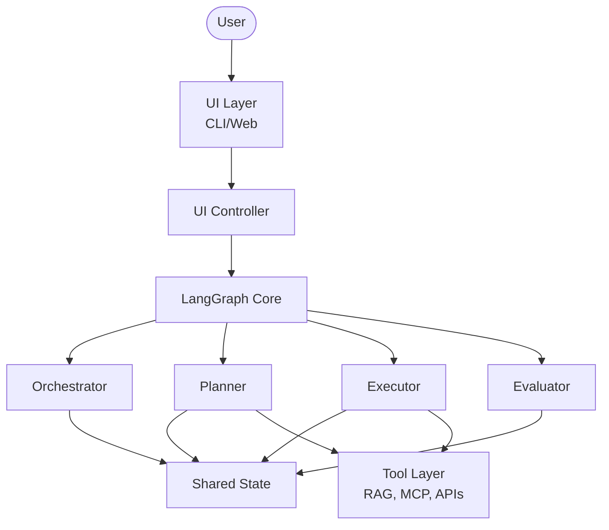
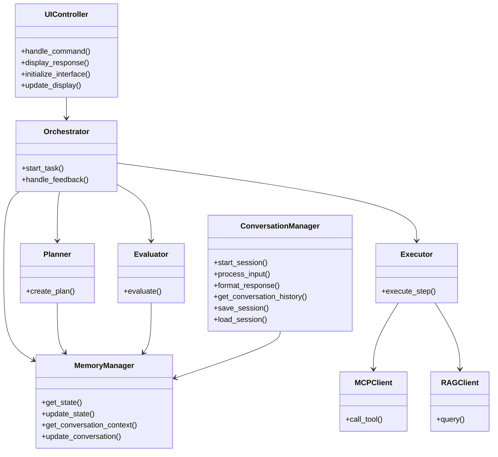
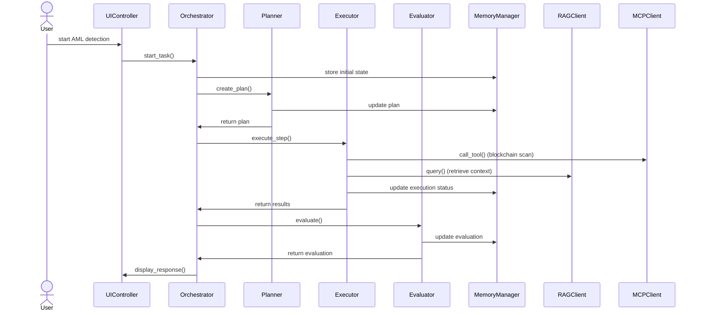

# Agentic AML Detection Application Design

## 1. System Overview

**Goal:**  
An agentic co-pilot application to assist AML (Anti-Money Laundering) detection on blockchain, using LangGraph for multi-agent orchestration.

**Key Features:**
- Modular AI agents (Orchestrator, Planner, Executor, Evaluator)
- Tool interfaces (RAG, MCP) for data retrieval and tool calls
- Memory/state management for context and history
- CLI (initially), with future GUI/Web extensibility
- Designed for explainability, traceability, and human-in-the-loop collaboration

---

## 2. High-Level Architecture

**Component Details:**
- **User:** AML analyst or investigator interacting with the system.
- **UI Layer:** CLI (initial), future GUI/Web. Handles user input/output.
- **UI Controller:** Mediates between UI and LangGraph, formats commands and responses.
- **LangGraph Core:** Manages agent workflow, state, and memory.
- **Agents:**
  - **Orchestrator:** Manages workflow, agent coordination, and feedback loops.
  - **Planner:** Decomposes tasks, creates actionable plans.
  - **Executor:** Executes plan steps, calls tools, gathers data.
  - **Evaluator:** Assesses results, determines next steps.
- **Shared State:** Central memory for context, history, and results.
- **Tool Layer:** RAG (retrieval), MCP (tool-calling), and external APIs for blockchain data.

---

## 3. UML Diagrams (Mermaid)

### 3.1 Class Diagram

### 3.2 Sequence Diagram: AML Detection Workflow

---

## 4. Use Cases

### 4.1 Detect Suspicious Transaction

**Actors:**
- User (AML Analyst)
- System (Agentic AML App)

**Preconditions:**
- User is authenticated and has access to the CLI.
- Blockchain data sources are configured.

**Main Flow:**
1. User starts a new AML detection task via CLI (e.g., `agent-app start --goal "Detect suspicious activity for address X"`).
2. System (Orchestrator) receives the request, initializes state, and logs the request.
3. Planner decomposes the task into actionable steps (e.g., fetch transactions, analyze patterns, check against risk lists).
4. Executor queries blockchain data using RAG/MCP tools, retrieves relevant transactions, and applies detection logic.
5. Evaluator assesses results (flags, risk scores, patterns, anomalies) and determines if further analysis is needed.
6. System presents findings, explanations, and supporting evidence to the user.
7. User can ask follow-up questions, request deeper analysis, or export results.

**Postconditions:**
- Task results are stored in memory and can be retrieved or exported.

**Extensions:**
- If data source is unavailable, system notifies user and retries or aborts.
- If suspicious activity is detected, system can suggest next steps or trigger alerts.

### 4.2 Interactive Investigation (Conversational Mode)

**Actors:**
- User
- System

**Preconditions:**
- User starts a chat session (e.g., `agent-app chat`).

**Main Flow:**
1. User enters chat mode.
2. User asks, "Show me all transactions above $10,000 from address Y."
3. System processes the request, retrieves and analyzes data, and presents results.
4. System maintains conversation context and history.
5. User asks, "Are any of these linked to known risk addresses?"
6. System performs further analysis, updates context, and responds.
7. Conversation continues, with memory of previous turns and context-aware responses.

**Postconditions:**
- Conversation history is saved and can be resumed or exported.

**Extensions:**
- User can use special commands (e.g., `/history`, `/export`, `/exit`).

### 4.3 Task Management

**Actors:**
- User
- System

**Main Flow:**
- List all active/recent AML detection tasks (`agent-app list`).
- Check status/results of a specific task (`agent-app status --task-id [id]`).
- Export findings or conversation history (`agent-app export --task-id [id]`).

**Extensions:**
- Filter tasks by status, date, or user.
- Resume or delete tasks as needed.

---

## 5. Key Design Notes & Details

### 5.1 LangGraph Integration
- **Workflow as Directed Graph:** Each agent is a node; edges define control and data flow.
- **State Management:** Shared state (conversation, plan, execution, evaluation, tool calls) is passed and updated at each step.
- **Conditional Routing:** After evaluation, workflow can loop back to planning or execution as needed.
- **Persistence:** State can be serialized for session recovery and auditability.

### 5.2 Agent Responsibilities
- **Orchestrator:** Entry point, manages workflow, error handling, and feedback.
- **Planner:** Task decomposition, step sequencing, tool/agent selection.
- **Executor:** Executes steps, calls tools, gathers and processes data.
- **Evaluator:** Assesses results, determines completion or next steps, provides feedback.

### 5.3 Tool Layer
- **RAG Tool:** Retrieves blockchain data, external context, or documentation.
- **MCP Tool:** Standardizes tool calls (e.g., risk scoring, address clustering, anomaly detection).
- **Extensibility:** New tools can be added by implementing the MCP interface.

### 5.4 Memory & State
- **Conversation History:** All user/agent interactions are logged with timestamps.
- **Task/Plan/Execution/Evaluation:** Each phase updates the shared state.
- **Session Management:** Supports multiple sessions, resumption, and export.
- **Persistence:** Uses local files (JSON/SQLite) for saving state and history.

### 5.5 UI Abstraction
- **CLI First:** Uses Typer/Click for commands, Rich/Prompt Toolkit for formatting.
- **Future-Proof:** UI Controller abstracts UI logic for easy GUI/Web integration.
- **Command Pattern:** All user actions are commands; responses are formatted for the UI.

### 5.6 Explainability & Traceability
- **Logging:** All agent actions, tool calls, and decisions are logged.
- **User Feedback:** System provides explanations and evidence for each result.
- **Audit Trail:** Full trace of each investigation is available for compliance.

### 5.7 Security & Privacy
- **Local Processing:** All data is processed locally unless explicitly configured otherwise.
- **Configurable Data Sources:** Only approved blockchain data sources are used.
- **Session Isolation:** Each session/task is isolated for privacy.

### 5.8 Extensibility
- **Modular Agents/Tools:** New agents or tools can be added with minimal changes.
- **Configurable Workflows:** Workflow graph can be extended for new use cases.

---

## 6. Implementation Roadmap

1. **Project Structure**
    - Create directories for core, agents, tools, memory, and UI.
    - Define configuration files for data sources and UI settings.
2. **LangGraph Workflow**
    - Implement agent nodes (Orchestrator, Planner, Executor, Evaluator) as LangGraph nodes.
    - Define state schema and transitions.
    - Add conditional routing for iterative workflows.
3. **CLI Interface**
    - Use Typer/Click for command parsing.
    - Implement commands: `start`, `status`, `list`, `chat`, `export`.
    - Add REPL for conversational mode.
4. **Tool Integration**
    - Implement RAG and MCP tool interfaces.
    - Add blockchain data connectors and risk analysis modules.
5. **Memory/State Management**
    - Implement MemoryManager for state, history, and session persistence.
    - Add support for session resumption and export.
6. **Conversation Management**
    - Implement ConversationManager for chat sessions.
    - Add context windowing and summarization for long sessions.
7. **Testing & Validation**
    - Create unit and integration tests for agents, tools, and workflows.
    - Test with real and synthetic blockchain data.
8. **Documentation & UI Extensions**
    - Document all modules and workflows.
    - Prepare for GUI/Web integration by maintaining clean UI abstraction.

---

## 7. References
- [LangGraph Documentation](https://langgraph.org/)
- [Mermaid Live Editor](https://mermaid-js.github.io/mermaid-live-editor/)
- [AML Detection on Blockchain: Concepts and Techniques](https://www.sciencedirect.com/science/article/pii/S0167404821002092)
- [Typer Documentation](https://typer.tiangolo.com/)
- [Rich Documentation](https://rich.readthedocs.io/en/stable/)

---

If you need rendered diagrams, code templates, or further breakdowns, let me know!
