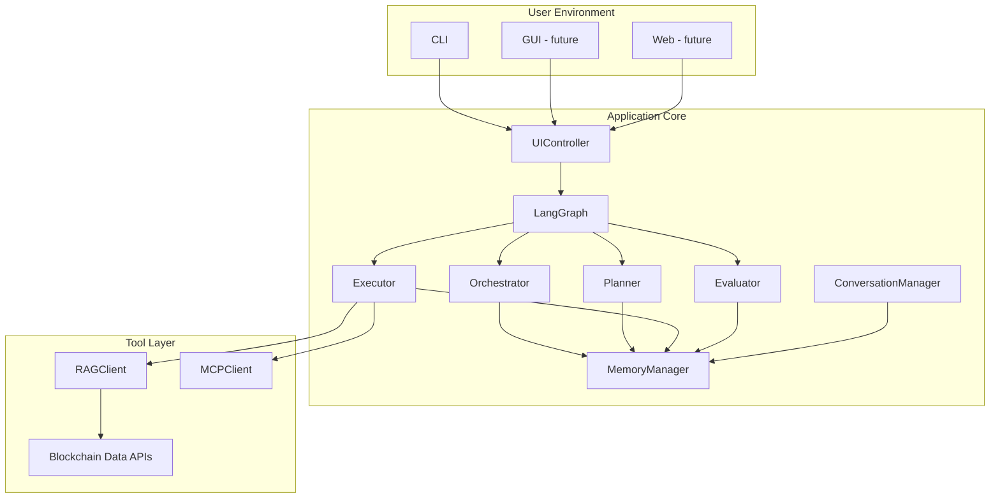

# Agentic AML Detection Application: Technical Design

## 1. Introduction

This technical design document details the implementation plan for the Agentic AML Detection Application, based on the application design. It covers system architecture, component responsibilities, data flow, technology stack, APIs, error handling, security, and extensibility.

---

## 2. System Architecture

### 2.1 Component Overview
- **UI Layer (CLI, future GUI/Web):** Handles user input/output, command parsing, and display.
- **UI Controller:** Mediates between UI and core, formats commands/responses, manages sessions.
- **LangGraph Core:** Orchestrates agent workflow, manages state, and coordinates memory.
- **Agents:**
  - **Orchestrator:** Entry point, workflow manager, error handler.
  - **Planner:** Task decomposition, step sequencing.
  - **Executor:** Executes steps, calls tools, gathers data.
  - **Evaluator:** Assesses results, determines next steps.
- **MemoryManager:** Handles state, conversation history, and persistence.
- **ConversationManager:** Manages chat sessions, context, and history.
- **Tool Layer:**
  - **RAGClient:** Retrieves blockchain data and context.
  - **MCPClient:** Standardizes tool calls (risk scoring, clustering, etc.).

### 2.2 Deployment Diagram (Mermaid)



---

## 3. Component Design

### 3.1 UI Layer
- **CLI:** Built with Typer/Click, supports commands (`start`, `status`, `list`, `chat`, `export`). Uses Rich/Prompt Toolkit for formatting.
- **Future GUI/Web:** Abstracted via UI Controller for easy integration.

### 3.2 UI Controller
- **Responsibilities:**
  - Parse and validate user commands.
  - Convert UI input to core system commands.
  - Manage session state and user context.
  - Format and display responses.
- **Interfaces:**
  - `handle_command(command_type, parameters)`
  - `display_response(response_data)`
  - `initialize_interface(config)`
  - `update_display(update_type, data)`

### 3.3 LangGraph Core
- **Responsibilities:**
  - Define workflow as a directed graph.
  - Manage state transitions and agent activations.
  - Support conditional routing and iterative flows.
- **State Schema:**
  - `messages: list[dict]` (conversation history)
  - `task: dict` (current task details)
  - `plan: list[dict]` (plan steps)
  - `execution: dict` (execution status/history)
  - `evaluation: dict` (evaluation results)
  - `tool_calls: list[dict]` (tool call history)
  - `context: dict` (additional context)

### 3.4 Agents
- **Orchestrator:**
  - Receives commands, initializes workflow, manages feedback loops.
- **Planner:**
  - Analyzes tasks, creates plans, selects tools/agents.
- **Executor:**
  - Executes plan steps, calls RAG/MCP tools, updates execution state.
- **Evaluator:**
  - Assesses results, determines workflow branching, provides feedback.

### 3.5 MemoryManager
- **Responsibilities:**
  - Store and retrieve workflow state, agent context, and tool call history.
  - Persist conversation context and history (JSON/SQLite).
  - Provide context to agents as needed.
- **Interfaces:**
  - `get_state(task_id)`
  - `update_state(task_id, state_delta)`
  - `get_conversation_context(session_id)`
  - `update_conversation(session_id, turn)`

### 3.6 ConversationManager
- **Responsibilities:**
  - Manage conversational sessions and their lifetime.
  - Track conversation history and maintain context.
  - Handle user input and format agent responses.
  - Provide context to Orchestrator for each interaction.
- **Interfaces:**
  - `start_session()`
  - `process_input(session_id, user_input)`
  - `format_response(session_id, response)`
  - `get_conversation_history(session_id)`
  - `save_session(session_id)`
  - `load_session(session_id)`

### 3.7 Tool Layer
- **RAGClient:**
  - HTTP client for blockchain data retrieval and context augmentation.
  - `query(query_payload)`
- **MCPClient:**
  - Standardized interface for tool calls (risk scoring, clustering, anomaly detection).
  - `call_tool(tool_name, params)`

---

## 4. Data Flow

### 4.1 Standard Task Flow
1. User initiates a task via CLI.
2. UI Controller parses and validates the command.
3. Orchestrator receives the command, initializes state.
4. Planner creates a plan and updates state.
5. Executor executes plan steps, calls tools, and updates execution state.
6. Evaluator assesses results, updates evaluation state, and determines next steps.
7. Orchestrator returns results to UI Controller for display.
8. MemoryManager persists state and history.

### 4.2 Conversational Flow
1. User starts a chat session.
2. ConversationManager manages session, context, and history.
3. Each user input is processed by Orchestrator and relevant agents.
4. Responses are formatted and displayed by UI Controller.
5. Conversation history is updated and persisted.

---

## 5. Technology Stack

- **Python 3.12** (primary runtime)
- **Poetry** (dependency and environment management)
- **LangGraph** (multi-agent workflow)
- **Typer/Click** (CLI)
- **Rich/Prompt Toolkit** (CLI formatting, REPL)
- **HTTPX/Requests** (HTTP clients for tools)
- **SQLite/JSON** (state and history persistence)
- **Mermaid** (documentation diagrams)
- **Pytest** (testing)

---

## 6. APIs and Interfaces

### 6.1 Internal APIs
- **UIController → Orchestrator:**
  - `start_task(task_payload)`
  - `handle_feedback(feedback)`
- **Orchestrator → Planner:**
  - `create_plan(task_context)`
- **Orchestrator → Executor:**
  - `execute_step(step, context)`
- **Orchestrator → Evaluator:**
  - `evaluate(result, context)`
- **Executor → RAGClient/MCPClient:**
  - `query(query_payload)`
  - `call_tool(tool_name, params)`
- **MemoryManager/ConversationManager:**
  - `get_state`, `update_state`, `get_conversation_context`, etc.

### 6.2 External APIs
- **Blockchain Data APIs:**
  - RESTful endpoints for transaction, address, and risk data.
- **Tool APIs:**
  - RAG/MCP endpoints for data retrieval and analysis.

---

## 7. Error Handling & Logging

- **Input Validation:** All user and API inputs are validated.
- **Error Propagation:** Errors are logged and surfaced to the user with actionable messages.
- **Retry Logic:** For transient tool/data errors, with exponential backoff.
- **Audit Logging:** All agent actions, tool calls, and decisions are logged for traceability.
- **Exit Codes:** CLI returns appropriate exit codes for automation.

---

## 8. Security & Privacy

- **Local Processing:** All sensitive data is processed locally unless configured otherwise.
- **Configurable Data Sources:** Only approved sources are used for blockchain data.
- **Session Isolation:** Each session/task is isolated for privacy.
- **Access Control:** CLI and future UIs require authentication for sensitive operations.
- **Data Encryption:** Optionally encrypt persisted state/history files.

---

## 9. Extensibility & Future Work

- **Modular Agents/Tools:** New agents/tools can be added by implementing standard interfaces.
- **Workflow Extensions:** LangGraph graph can be extended for new AML scenarios.
- **UI Extensions:** GUI/Web can be added by implementing new UI layers and reusing UI Controller.
- **Plugin System:** Future support for third-party analysis plugins.

---

## 10. Testing & Validation

- **Unit Tests:** For all agents, tools, and managers.
- **Integration Tests:** For end-to-end workflows and data flows.
- **Mocking:** Use mock data for blockchain and tool APIs.
- **Continuous Integration:** Automated testing pipeline.

---

## 11. Documentation & Deployment

- **Code Documentation:** Docstrings and module-level docs for all components.
- **User Documentation:** CLI help, usage guides, and example workflows.
- **Deployment:**
  - Python 3.12 required.
  - Poetry used for dependency and environment management (`poetry install`, `poetry run`).
  - Local install via Poetry (preferred) or pip/venv.
  - Dockerfile for containerized deployment (future).
  - Configuration via local JSON/YAML files.

---

## 12. Appendix: Example State Schema

```python
class AgentState(TypedDict):
    messages: list[dict]  # Conversation history
    task: dict            # Current task details
    plan: list[dict]      # Plan created by Planner
    execution: dict       # Execution status and history
    evaluation: dict      # Evaluation results
    tool_calls: list[dict]  # History of tool calls and responses
    context: dict         # Additional context information
```

---

For further details, see the application design document or request code templates for any component.
